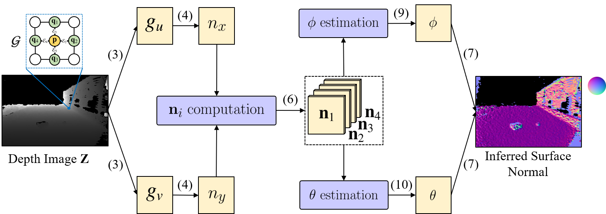

# Normal Inference Module
This is a PyTorch demo of the Normal Inference Module (NIM), presented in our IROS 2020 paper, [Applying Surface Normal Information in Drivable Area and Road Anomaly Detection for Ground Mobile Robots](https://arxiv.org/abs/2008.11383). Our NIM can be used effectively for estimating surface normal information from depth images. The code has been tested in Python 3.6 and PyTorch 1.7.

<p align="center">

</p>

We provide two examples in `examples`, where `rgb`, `depth_u16` and `calib` contain RGB images, depth images and calibration files, respectively. These examples belong to the [KITTI road dataset](http://www.cvlibs.net/datasets/kitti/eval_road.php).

Run `demo.py`, and then the surface normal estimation will be saved in `examples/normal`. Please note that our NIM can run in two different ways. Set `sign_filter=True`, and then our NIM will additionally utilize a sign filter.

If you use this code for your research, please cite our paper.
```
@inproceedings{wang2020applying,
  title        = {Applying surface normal information in drivable area and road anomaly detection for ground mobile robots},
  author       = {Wang, Hengli and Fan, Rui and Sun, Yuxiang and Liu, Ming},
  booktitle    = {2020 IEEE/RSJ International Conference on Intelligent Robots and Systems (IROS)},
  pages        = {2706--2711},
  year         = {2020},
  organization = {IEEE},
  doi          = {10.1109/IROS45743.2020.9341340}
}
```